# Recipe Reviews Rating Prediction

## Overview

This project explores a large dataset of recipe reviews to demonstrate an end-to-end data analytics and machine learning workflow.  
It covers data preparation, exploratory data analysis, feature engineering, model development, and evaluation, all applied to predict user ratings (1–5 stars) from both numeric and textual review data.

The analysis was developed as part of the Master of Data Analytics program at the University of Niagara Falls, Canada, and reflects the type of practical and interpretable work expected from an entry-level data analyst or co-op student.

---

## 1. Project Objectives

- Understand how engagement metrics and review text relate to user satisfaction.  
- Prepare a high-quality, clean dataset suitable for predictive modeling.  
- Build and compare baseline and advanced models for rating prediction.  
- Explore class imbalance handling and discuss business implications.  
- Present results through interpretable visualizations and metrics.

---

## 2. Methodology

| Stage | Description | Outcome |
|--------|-------------|----------|
| **Data Cleaning** | Managed missing values, removed duplicates, normalized categorical variables. | Final dataset: 18,180 rows × 20 columns. |
| **Exploratory Data Analysis (EDA)** | Visualized distributions, correlations, and relationships with the target variable. | Identified skewed features and class imbalance (76% of 5-star reviews). |
| **Feature Engineering** | Created log-transformed and text-based features; encoded categorical variables. | Generated a balanced, interpretable feature set. |
| **Modeling** | Built Logistic Regression and Random Forest models with and without balancing. | Random Forest achieved 0.76 accuracy; balancing improved recall. |
| **Evaluation** | Compared metrics and confusion matrices; analyzed ROC performance. | AUC ≈ 0.67 for detecting 5-star reviews vs others. |

---

## 3. Key Visualizations

### Exploratory Data Analysis
| Numeric Distributions | Correlations | Categories vs Ratings |
|------------------------|--------------|------------------------|
| 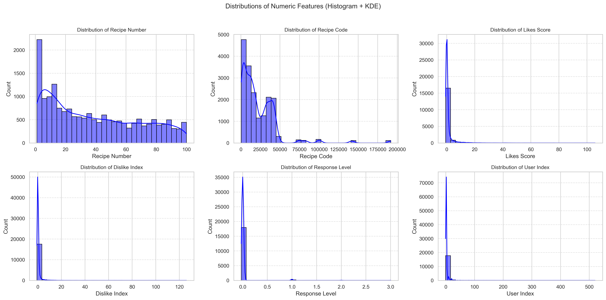 | 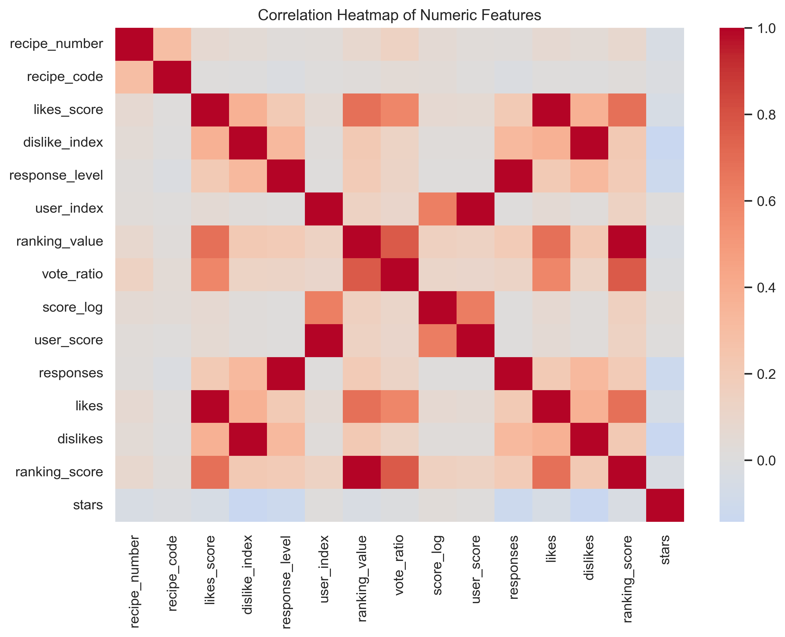 | 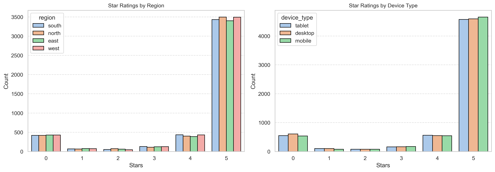 |

### Feature Engineering
| Word Count Distribution | Log Transformation | Feature Importance |
|--------------------------|--------------------|--------------------|
| 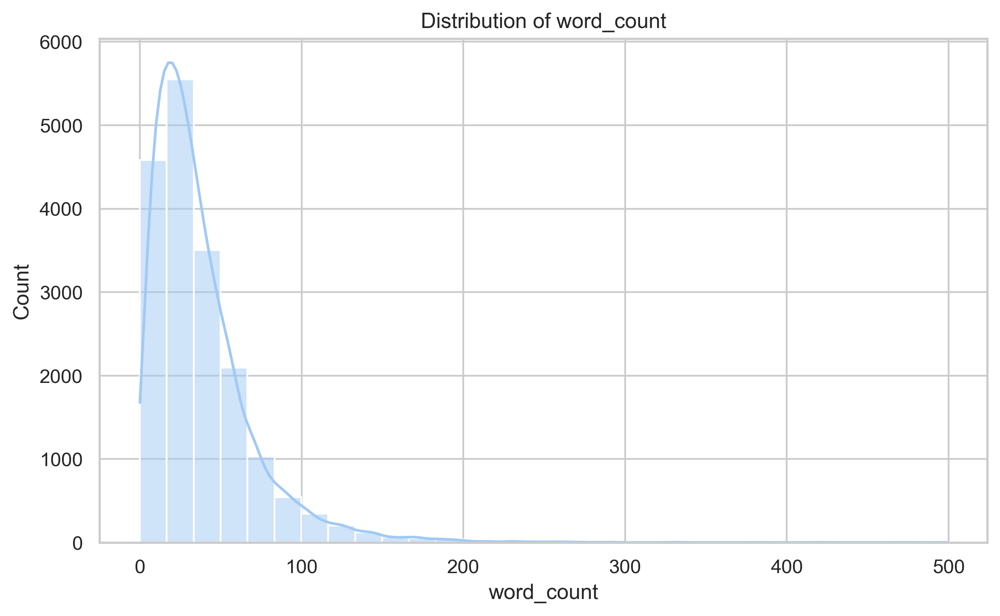 | 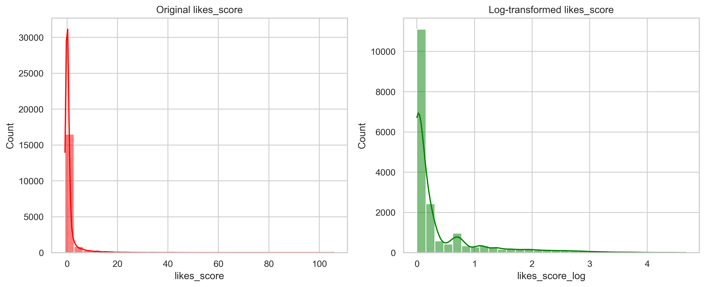 | 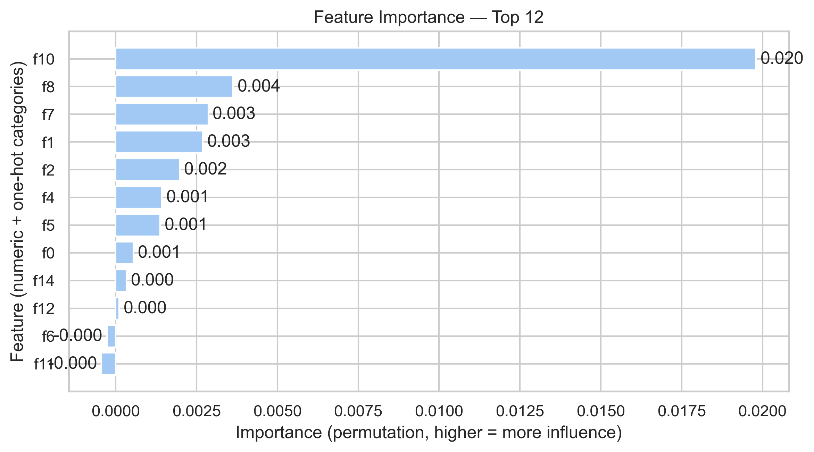 |

### Model Evaluation
| Logistic Regression | Random Forest | Random Forest (Tuned) |
|---------------------|---------------|------------------------|
| 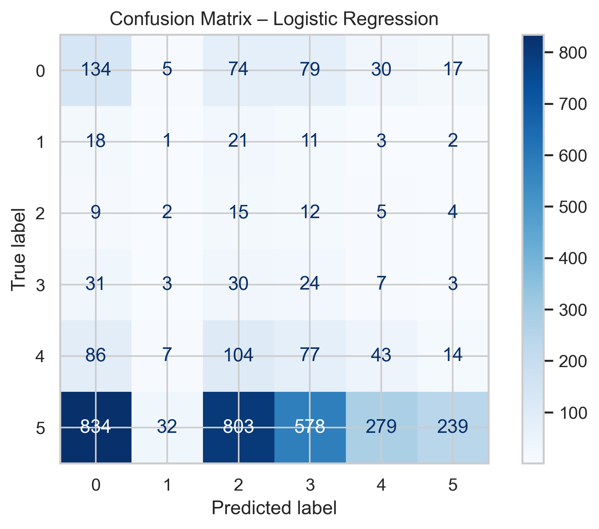 | 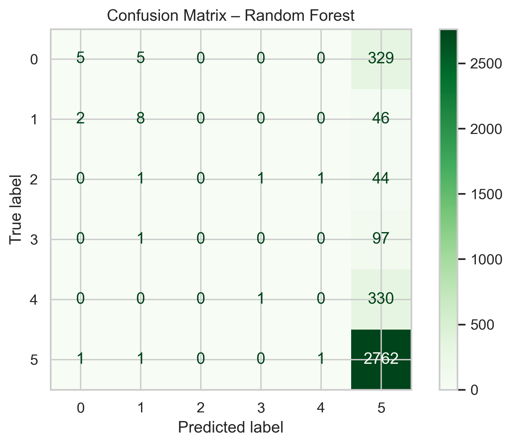 | 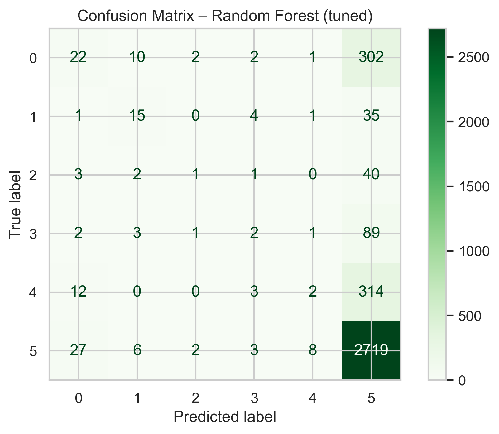 |

### Advanced Evaluation
| Balanced Models | ROC Curve (5 Stars vs Rest) |
|-----------------|------------------------------|
| 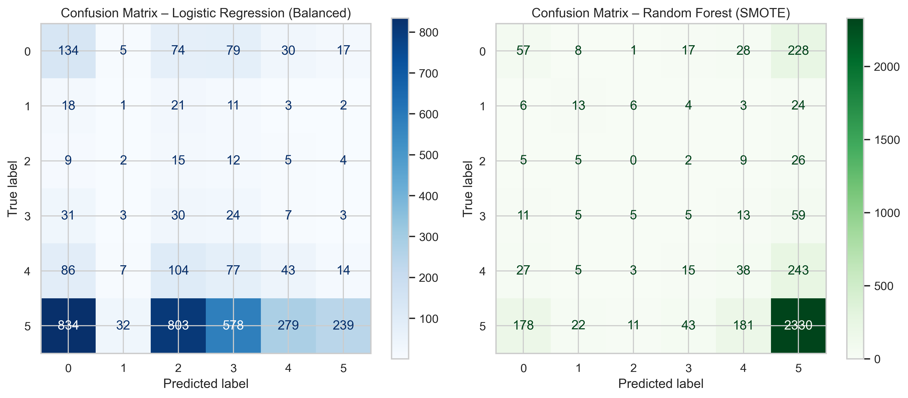 | 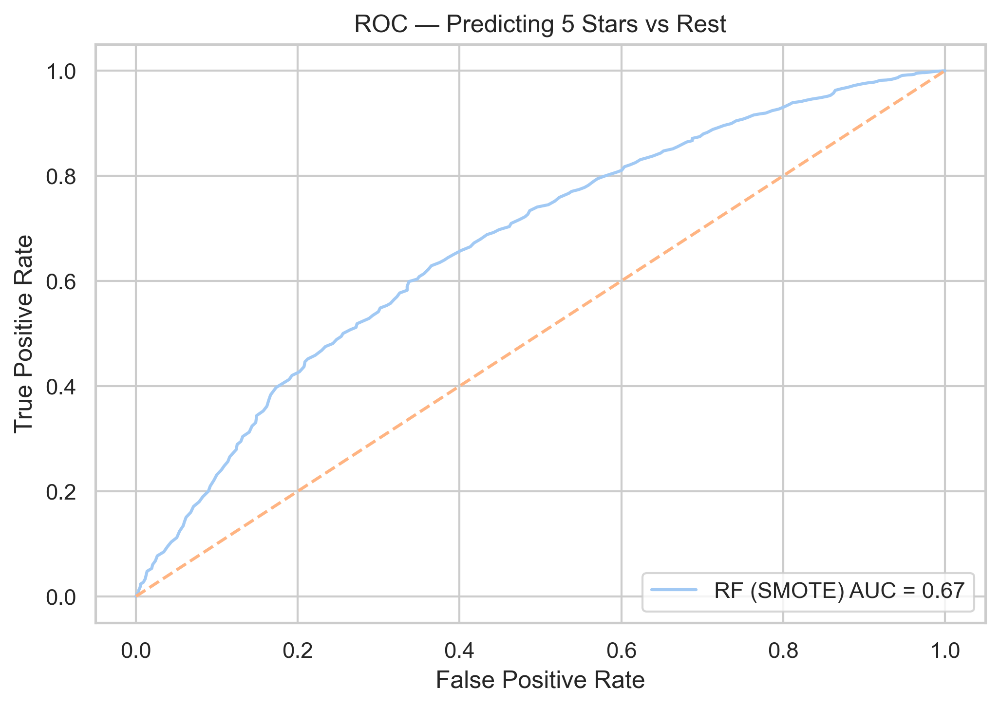 |

---

## 4. Technical Summary

**Languages and Tools**  
Python, Pandas, NumPy, Matplotlib, Seaborn, Scikit-learn, Imbalanced-learn, Jupyter Notebook, Visual Studio Code.

**Techniques Used**  
Data profiling, feature scaling, log transformation, one-hot encoding, model evaluation metrics, SMOTE oversampling, and ROC analysis.

**Performance Summary**

| Model | Accuracy | Macro F1 | Notes |
|--------|-----------|-----------|-------|
| Logistic Regression | 0.32 | Low | Interpretable but weak under class imbalance. |
| Random Forest | 0.76 | Moderate | Strong non-linear performance but biased toward majority class. |
| Random Forest + SMOTE | 0.67 | Balanced | Improved recall for minority classes. |
| Tuned Random Forest | 0.759 | Stable | Consistent results after pruning redundancy. |

---

## 5. Main Insights

- The dataset exhibits **severe class imbalance** with a dominance of 5-star reviews.  
- Numeric features such as `likes_score` and `dislike_index` show strong right skew; log transformations improve stability.  
- **Engagement-related variables** (likes, dislikes, ranking) have the highest predictive power.  
- Models without balancing tend to overfit to the majority class.  
- Balanced models provide more useful insights for real-world applications where detecting negative feedback matters most.

---

## 6. Business Interpretation

From a product or service management perspective:

- The high share of 5-star ratings suggests strong user satisfaction but reduces visibility of weak points.  
- **Minority (low-rating) reviews** are critical for early identification of quality or experience issues.  
- Predictive models can support customer experience teams by flagging potentially negative feedback automatically.  
- Even if accuracy decreases slightly, a balanced model offers better decision value for operations and reputation management.

---

## 7. Next Steps

- Integrate Natural Language Processing (TF-IDF or embeddings) to extract sentiment and tone from text reviews.  
- Test gradient boosting algorithms (XGBoost, LightGBM) for finer class separation.  
- Simplify prediction goal to a binary task: Positive (4–5) vs Negative (0–3) ratings.  
- Collect more low-rating examples to improve minority learning.  
- Automate retraining pipeline and deploy lightweight model through an interactive dashboard.

---

## 8. Repository Structure
```
recipe-reviews-rating-prediction/
│
├── data/
│ └── recipe_reviews.csv
│
├── notebook/
│ └── recipe_reviews_analysis_light_github.ipynb
│
├── outputs/
│ ├── categorical_distributions.png
│ ├── correlation_heatmap.png
│ ├── feature_importance.png
│ ├── confusion_matrix_random_forest.png
│ ├── roc_curve_random_forest_5stars.png
│ └── (other visualizations)
│
├── LICENSE
├── README.md
└── .gitignore
```

---

## 9. Author

**José Antonio Ayón Wu**  
Master of Data Analytics — University of Niagara Falls, Canada  
Location: Ontario  
Email: joseayonwu@gmail.com  
GitHub: [joseayonwu](https://github.com/joseayonwu)

---

## 10. Notes for Reviewers and Employers

This repository is designed to reflect the analytical rigor, documentation style, and technical communication expected in Canadian data analyst co-op positions.  
It prioritizes reproducibility, clarity, and business interpretation over automated visuals or template aesthetics.

All visualizations were generated programmatically; no outputs were manually edited.  
The notebook version published here is a lightweight “clean” version without warnings or large prints to ensure smooth rendering on GitHub.

---
