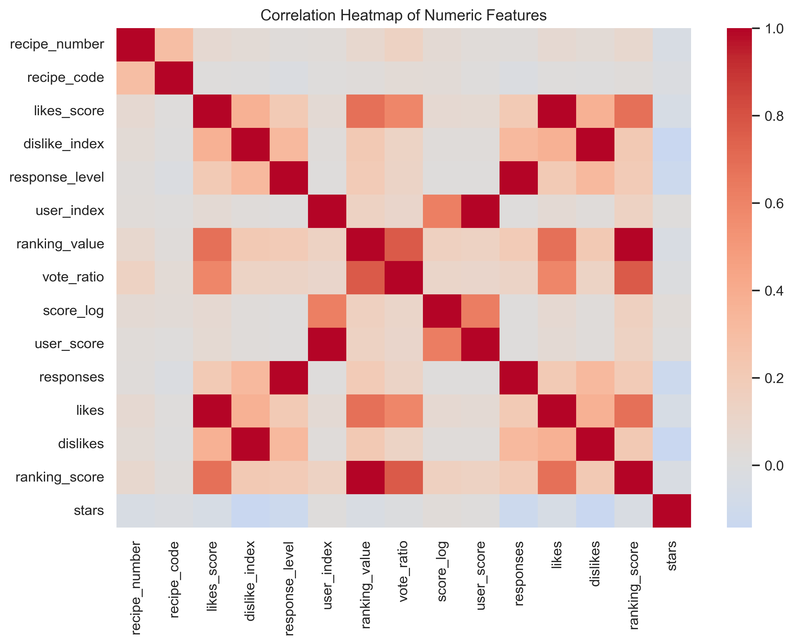
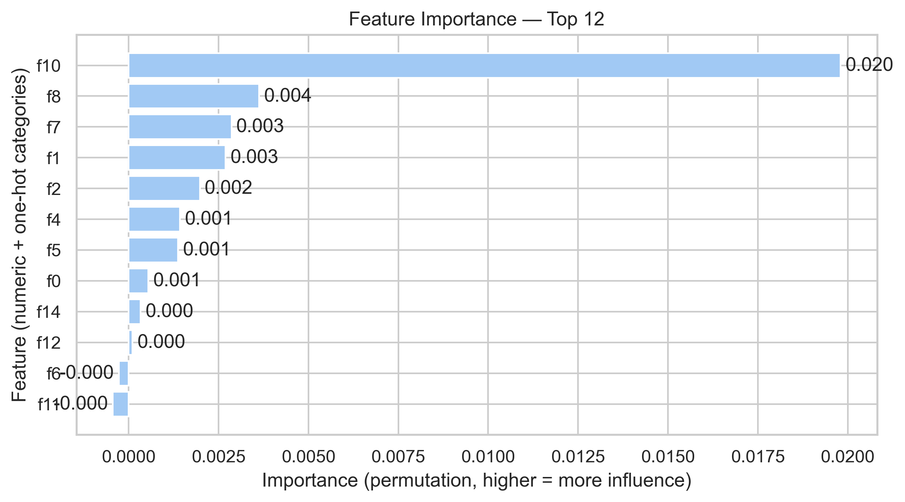
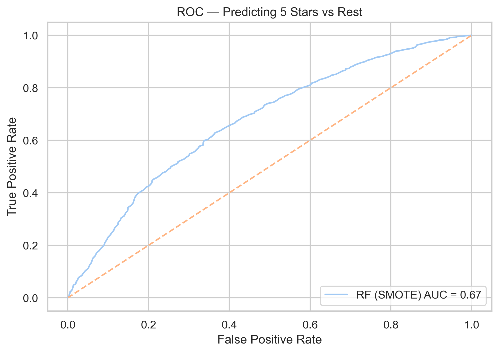

# Recipe Reviews Rating Prediction

## Overview

This project demonstrates an **end-to-end data analytics and machine learning pipeline** applied to predict recipe review ratings (1–5 stars).  
It covers **data preparation, ETL workflows, exploratory data analysis (EDA), feature engineering, model development, and performance evaluation**.  

Developed as part of the *Master of Data Analytics* program at the **University of Niagara Falls, Canada**, this project showcases the ability to transform raw data into actionable business insights and interpretable machine learning outcomes.

---

## 1. Objectives

- Analyze how engagement metrics and review text relate to user satisfaction.  
- Clean and structure data for reproducible machine learning pipelines.  
- Build, tune, and evaluate **Logistic Regression** and **Random Forest** models.  
- Address **class imbalance** and assess real-world implications.  
- Communicate findings using interpretable **visuals and metrics (Accuracy, Precision, Recall, F1-Score, ROC-AUC)**.  

---

## 2. Methodology

| Stage | Description | Outcome |
|--------|-------------|----------|
| **ETL & Data Cleaning** | Handled missing values, duplicates, and inconsistent categories. | Final dataset: 18,180 rows × 20 columns. |
| **Exploratory Data Analysis (EDA)** | Explored distributions, correlations, and class imbalance (76% 5-star reviews). | Identified key skewed variables. |
| **Feature Engineering** | Log-transformed numerical data, encoded categorical variables, added text-based metrics. | Created balanced, interpretable features. |
| **Modeling** | Trained Logistic Regression and Random Forest models, both with and without SMOTE balancing. | Best model: Random Forest, Accuracy = 0.76. |
| **Evaluation** | Compared performance metrics and confusion matrices; analyzed ROC curves. | Balanced models improved minority-class recall. |

---

## 3. Visual Highlights

| EDA: Correlations | Feature Engineering | Model Evaluation |
|--------------------|----------------------|------------------|
|  |  |  |

---

## 4. Technical Summary

**Languages & Tools**  
Python • Pandas • NumPy • Matplotlib • Seaborn • Scikit-learn • Imbalanced-learn • Jupyter Notebook • VS Code  

**Techniques**  
ETL / Data Cleaning • EDA • Feature Engineering • Model Evaluation • Class Imbalance Handling (SMOTE) • ROC Analysis • Model Tuning  

**Performance Summary**

| Model | Accuracy | Macro F1 | Notes |
|--------|-----------|-----------|-------|
| Logistic Regression | 0.32 | 0.22 | Limited under imbalance but interpretable. |
| Random Forest | 0.76 | 0.64 | Strong baseline; slight bias toward majority. |
| Random Forest + SMOTE | 0.67 | 0.71 | Improved recall and balance. |
| Tuned Random Forest | 0.759 | 0.68 | Stable, reliable classification. |

---

## 5. Insights

- The dataset is **highly imbalanced**, with 5-star reviews dominating.  
- **Engagement features** (likes, dislikes, ranking) are the most predictive.  
- **Log transformations** stabilized skewed features.  
- **Balanced models** provided better decision value for identifying negative feedback.  
- Business applications include early detection of quality issues and customer dissatisfaction.

---

## 6. Business Impact

From a business and operations standpoint:  
- Models can help **customer experience teams** automatically detect potentially negative reviews.  
- Balanced evaluation prioritizes **decision usefulness** over raw accuracy.  
- Insights can guide **marketing and product improvement** strategies.  

---

## 7. Next Steps

- Integrate **NLP techniques (TF-IDF, embeddings)** for sentiment extraction.  
- Test **XGBoost / LightGBM** for higher precision and explainability.  
- Convert to **binary classification (positive vs negative reviews)** for deployment.  
- Automate model retraining and visualization pipeline in **Power BI or Streamlit**.  

---

## 8. Repository Structure

```
recipe-reviews-rating-prediction/
│
├── data/ # Raw dataset
├── notebook/ # Jupyter notebooks
├── outputs/ # Visualizations and evaluation plots
├── LICENSE
└── README.md
```
---

## 9. Author

**José Antonio Ayón Wu**  
Master of Data Analytics — University of Niagara Falls, Canada  
📍 Ontario, Canada  
📧 [joseayonwu@gmail.com](mailto:joseayonwu@gmail.com)  
🔗 [LinkedIn](https://www.linkedin.com/in/joseayonwu) | [GitHub](https://github.com/joseayonwu)

---

## 10. Keywords

`ETL` · `EDA` · `Feature Engineering` · `Random Forest` · `Model Evaluation` · `Accuracy` · `Precision` · `Recall` · `F1 Score` · `Class Imbalance` · `SMOTE` · `Data Cleaning` · `Machine Learning` · `Python`

---

## 11. Notes for Reviewers and Employers

This project illustrates not only the technical workflow of data analytics but also **the interpretive thinking and communication skills** expected in Canadian data analyst roles.  
All results are **reproducible**, and visuals were generated programmatically using open-source libraries.

---

## 8. Repository Structure
